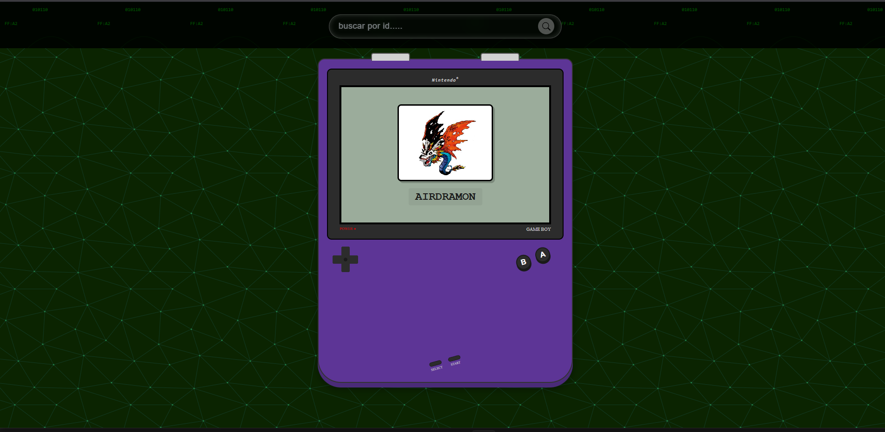
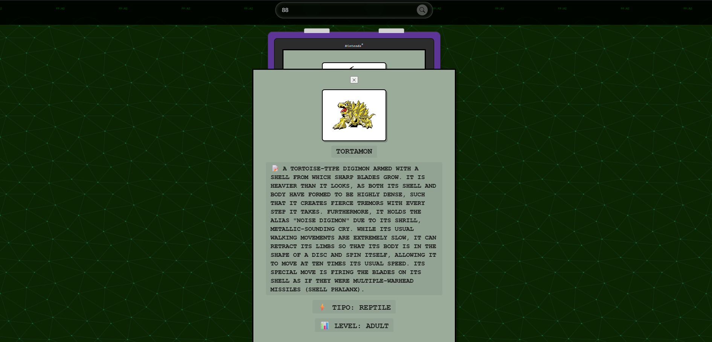

# 🎮 Digivice Estilo GameBoy

**Proyecto realizado por:** Carlos  Elias Tzoy Velasco
**Descripción:** Aplicación interactiva que simula un dispositivo Digivice con diseño retro tipo GameBoy, donde puedes explorar una colección de digimons (5), navegar entre ellos usando botones de carrusel y buscar digimons específicos por ID.

---

## 📱 ¿Qué hace la aplicación?

Esta aplicación es un simulador interactivo de un Digivice (dispositivo ficticio de Digimon) con interfaz estilo GameBoy clásico. Sus funcionalidades incluyen:

- **Carrusel de digimons**: Visualiza una lista de digimons que puedes navegar usando los botones A y B del dispositivo simulado
- **Búsqueda por ID o NOMBRES**: Busca un digimon específico ingresando su ID/Nombres en el buscador
- **Modal de detalles**: Visualiza información completa del digimon (imagen, descripción, tipo, nivel)
- **Diseño retro**: Interfaz completa que imita la estética de una GameBoy original

---

## 🔌 API Utilizada

**Digi API** - API gratuita que proporciona información completa sobre digimons

- **Documentación oficial:** https://digi-api.com/api/v1/digimon
- **Endpoints principales:**
  - `GET /api/v1/digimon` - Obtiene la lista de todos los digimons
  - `GET /api/v1/digimon/{id}` - Obtiene los detalles de un digimon específico

---

## 🖥️ Instrucciones para ejecutarla localmente

### Requisitos:
- Un navegador web moderno (Chrome, Firefox, Edge, Safari)
- Conexión a internet (para consumir la API)

### Pasos:

1. **Clona o descarga el proyecto**
   ```bash
   git clone https://github.com/Velasco-c/Taller-2_JavaScript.git
   cd Taller-2_JavaScript
   ```

2. **Abre el archivo index.html**
   - **Opción 1:** Haz doble clic en `index.html`
   - **Opción 2:** Click derecho → "Abrir con" → Selecciona tu navegador
   - **Opción 3:** En VS Code, usa la extensión "Live Server" (clic derecho en `index.html` → "Open with Live Server")

3. **¡Disfruta!**
   - Usa los botones A y B para navegar por el carrusel de digimons
   - Ingresa un ID en el buscador y presiona Enter o haz clic en el botón de búsqueda
   - Haz clic en la X para cerrar el modal de detalles

---

## 📁 Estructura del proyecto

```
Taller-2_JavaScript/
├── index.html          # Estructura HTML principal
├── css/
│   └── style.css       # Estilos CSS (diseño GameBoy y responsive)
├── javascript/
│   └── mian.js         # Lógica JavaScript (API calls, eventos)
├── imagenes/
│   ├── fondo.svg       # Fondo decorativo del body
│   └── iconos/
│       └── search.svg  # Icono del buscador
└── readme.md           # Este archivo
```

---

## 🎯 Funcionalidades principales

### 1. **Carrusel de Digimons**
- Carga automáticamente todos los digimons desde la API
- Navega con botones A (adelante) y B (atrás)
- Scroll suave y snapping automático

### 2. **Búsqueda por ID**
- Ingresa el ID del digimon que deseas buscar
- Presiona Enter o haz clic en el botón de búsqueda
- Se abre un modal con información detallada:
  - Imagen del digimon
  - Nombre
  - Descripción
  - Tipo
  - Nivel

### 3. **Diseño Retro GameBoy**
- Pantalla verde clásica (#9bac9b)
- Botones interactivos (D-pad, A, B, Start, Select)
- Gatillos L y R en la parte superior
- Efectos visuales y sombras retro

---

## 🛠️ Tecnologías utilizadas

- **HTML5** - Estructura semántica
- **CSS3** - Diseño responsivo con Flexbox, Grid y variables CSS
- **JavaScript (ES6+)** - Fetch API, async/await, DOM manipulation
- **Digi API** - Fuente de datos de digimons

---

## 📸 Imágenes de Prueba

### Captura 1:


### Captura 2:


---

## 🎓 Créditos

Desarrollado como parte del **Taller #2 de JavaScript** bajo la mentoría de Campuslands

**API:** [Digi API](https://digi-api.com/)

---

## 📞 Contacto

Si tienes preguntas o sugerencias sobre este proyecto, puedes contactarme a través de:
- GitHub: [(https://github.com/Velasco-c)]
- Email: [carlos.velasco.est@gmail.com]

---

**Última actualización:** Mayo 2026
